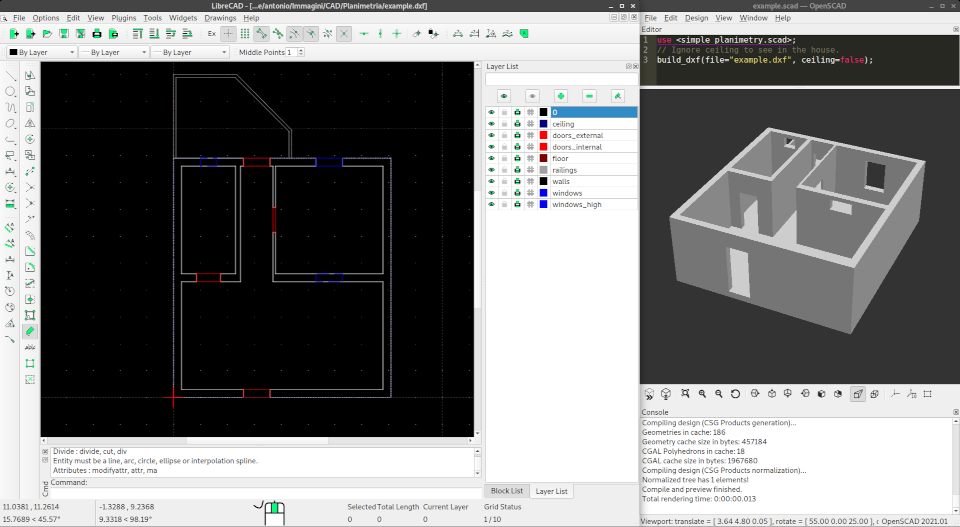
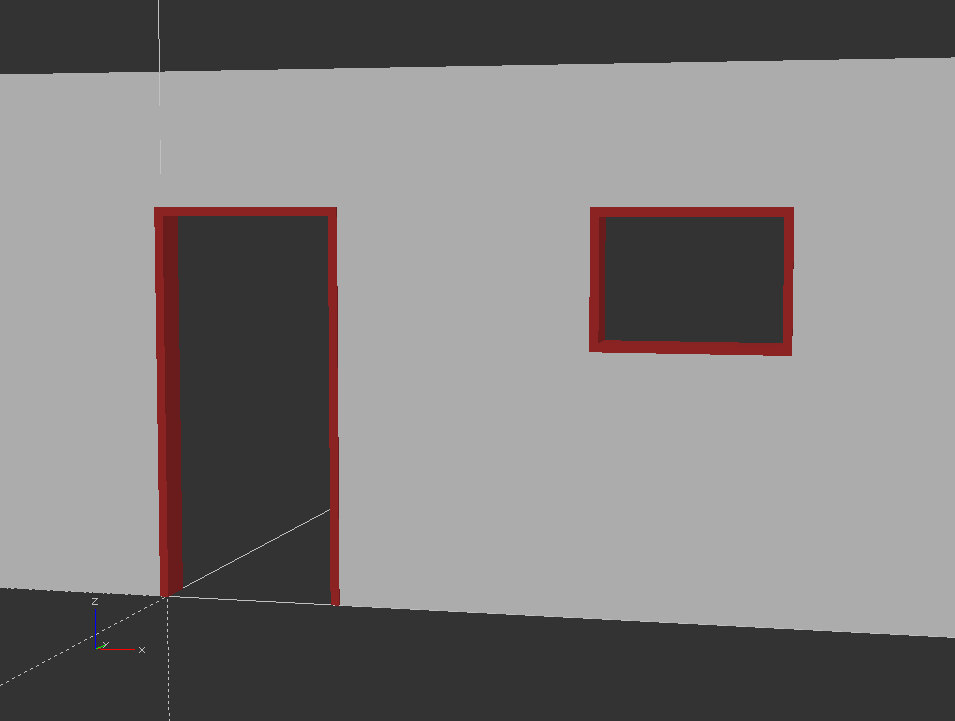

# Fast 3D Planimetry
A simple way to make 3D from 2D planimetry

## Fast-start
1. Download `example.dxf`, `example.scad` and `simple_planimetry.scad` in the same directory
2. Open `example.scad` to view 3D
3. Open `example.dxf` with your 2D-CAD editor
4. Edit dxf, save and update preview on openSCAD to see changes

## Wall Frame
With `wall_frame` module you can easily draw frames around doors and windows

**INPUTS:**
- `hole_width`: the width of the wall hole
- `hole_depth`: the depth of the wall hole
- `hole_height`: the height of the wall hole
- `frame_thickness`: the thickness of the frame
- `frame_overhang`: the overhang of the frame
- `erase_bottom` (default false): true to erase the frame at the bottom
